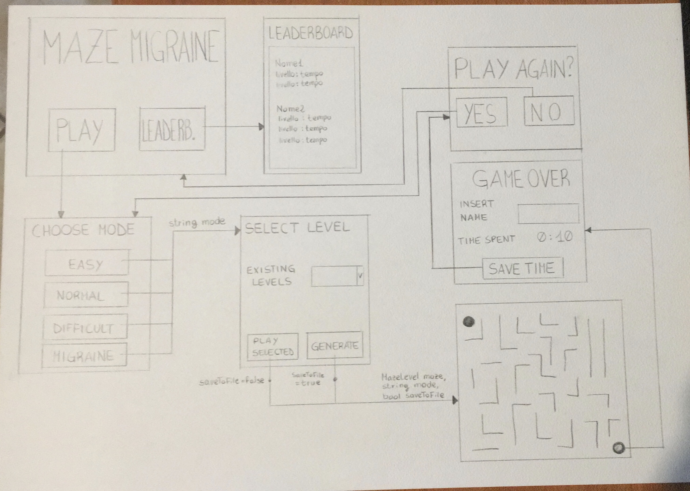

# Maze Migraine
Maze Migraine is a simple 2D timed maze-escape game with random level generation.


## Context
Maze Migraine is the result of a project assigned by my IT teacher in the last year of high school.
The goal was to create a simple game using C# and WPF covering different aspects such as:
- Graphics
- Music & Audio
- Gameplay
- XML Serialization / File Handling
- Efficiency


## App Workflow



## Installation
You can install and run the program following these steps:
1. Clone this repo to your local machine using ```git clone https://github.com/Borotalcohol/MazeMigraine.git```
2. The executable file is called MazeMigraine.exe and it's located in **bin/Debug/**.
3. \[Optional\] In order to modify the source code, you'll have to use Visual Studio (2019 recommended)


## How does it work?
The way it works is that you can choose to generate a new random maze for each of the difficulty levels
(Easy 10x10, Normal 20x20, Difficult 30x30). Whenever you generate a new maze, it gets saved, so you and
other players can choose to replay that particular level.


## How do you generate maze levels?
There are plenty of ways you can [Generate a Maze](https://en.wikipedia.org/wiki/Maze_generation_algorithm).
The one I've decided to implement was the iterative version of the [Randomized Depth-First Search](https://en.wikipedia.org/wiki/Maze_generation_algorithm#Randomized_depth-first_search).

